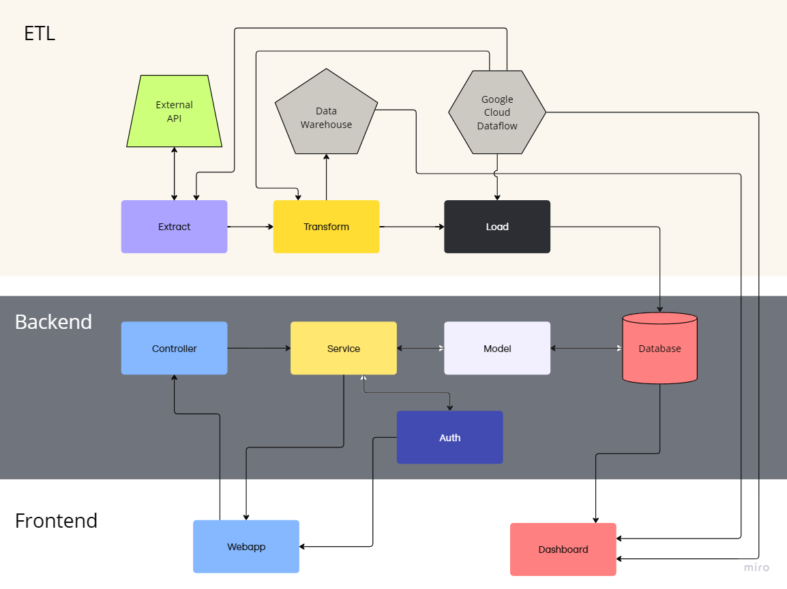

# ReelRecs Organization

Welcome to the ReelRecs, a comprehensive movie recommendation system designed to provide personalized and popularity-based movie suggestions. This project is my solo endeavor, built using advanced data analytics and machine learning techniques to enhance movie discovery for users.

## Repositories
- **ReelRecs-core**: Contains all backend logic, handling functionalities such as user authentication and data management.
- **ReelRecs-webapp**: The front-end application that users interact with, built to provide a smooth and responsive experience.
- **ReelRecs-data-pipeline**: Manages automated ETL processes for integrating external data into the system.
- **ReelRecs-dashboards**: Focuses on the visualization of user data and system performance through Google Data Studio.
- **ReelRecs-legacy**: This repository hosts the original Jupyter Notebook version of the project, serving as the foundational legacy code from which the revamped ReelRecs project was derived.

## UML Diagram: System Architecture

The diagram below provides an overview of the ReelRecs architecture, showing the relationships between the key components: the **core backend**, **ETL pipeline**, **webapp**, and **dashboard**.

### **Explanation of Components:**
- **External API**: Sources data for the system (e.g., TMDb, IMDb).
- **ReelRecs-core**: Handles backend logic, including API requests, user authentication, and business logic for recommendations.
- **ReelRecs-data-pipeline**: Automates the ETL process, fetching raw data from external APIs, transforming it, and loading it into the database.
- **ReelRecs-webapp**: Provides the user interface for interacting with the system.
- **ReelRecs-dashboards**: Visualizes system performance, metrics, and user data analytics.

---

## Project Setup
(Include project setup instructions here)

For more details on each component, please visit the respective repositories linked above.
